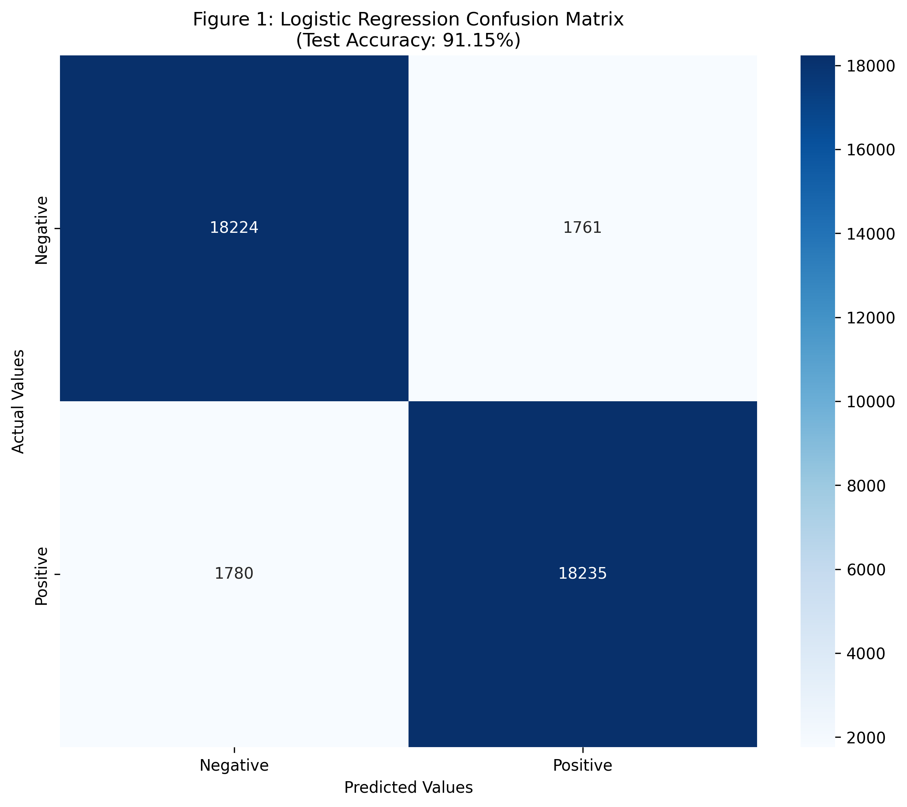

# 📊 Advanced Amazon Reviews: Hybrid Sentiment & NER Insights

This repository contains a comprehensive **Natural Language Processing (NLP)** pipeline designed to extract business intelligence from customer feedback. By integrating **Sentiment Analysis** and **Named Entity Recognition (NER)**, the system identifies both customer emotions and the specific entities (brands, products, prices) mentioned in the reviews.

## 👤 Author
*   **Hayat Diler**
*   **Computer Engineering Student** (Junior) at **Marmara University**
*   **Focus**: Artificial Intelligence, Machine Learning & NLP

---

## 🚀 Project Overview
The system is trained on a **balanced dataset of 200,000 Amazon product reviews**. It follows a strict **"No Data Leakage"** pipeline where feature extraction (TF-IDF) is strictly isolated between training and testing sets to ensure scientific integrity and prevent biased results.

### Key Features:
*   **Data Preprocessing**: Regex-based cleaning, stopword filtering (preserving sentiment-critical words like "not" and "no"), and NLTK-based lemmatization.
*   **Feature Extraction**: TF-IDF Vectorization with N-Grams ($ngram\_range=(1, 2)$) to capture complex phrases and contextual sentiment polarity.
*   **Model Benchmarking**: Comprehensive comparison of Naive Bayes, Logistic Regression, Linear SVM, Random Forest, and XGBoost using **5-Fold Cross-Validation**.
*   **Hybrid Analysis**: Integrated **SpaCy NER** (`en_core_web_sm`) to detect specific entities such as Brands, Products, Monetary values, and Locations within the reviews.

---

## 📊 Dataset
The dataset used in this project is the **Amazon Reviews for Sentiment Analysis**, which can be downloaded from Kaggle.
*   **Source**: [Kaggle - Amazon Reviews for Sentiment Analysis](https://www.kaggle.com/datasets/bittlingmayer/amazonreviews)
*   **Format**: The raw data is in `.bz2` format. After preprocessing, a balanced subset of 200,000 reviews was used for training and evaluation.

---

## 🏆 Performance Leaderboard
The models were evaluated using **5-Fold Cross-Validation** on the full 200K dataset to ensure scientific reliability.

| Model | Accuracy (Single Run) | K-Fold Mean Accuracy | F1-Score | Training Time |
| :--- | :--- | :--- | :--- | :--- |
| **Logistic Regression** | **91.15%** | **90.65%** | **0.91** | **6.6s** |
| **Linear SVM** | 90.98% | 90.50% | 0.91 | 24.3s |
| **Naive Bayes** | 88.63% | 88.30% | 0.89 | 0.7s |
| **Random Forest** | 87.61% | 87.07% | 0.87 | 1226.1s |
| **XGBoost** | 86.62% | 86.32% | 0.87 | 917.8s |

**The Champion Model**: **Logistic Regression** was selected for production deployment due to its optimal balance between high accuracy (90.65%) and rapid inference time.

---

### 📈 Confusion Matrix (Champion Model)




*The confusion matrix shows a high recall for negative reviews, which is critical for identifying customer dissatisfaction early.*

---

## 🔍 The Power of Hybrid Analysis: Real-World Performance

Standard sentiment analysis only tells you *how* a customer feels. This system tells you *why* they feel that way by linking sentiment to specific entities, even in complex "contrast" sentences.

**Input Test Case:**  
> *"I ordered the new Sony PlayStation 5 from the Amazon New York warehouse for $500, but it arrived two days late and the DualSense controller has a drift issue. Very disappointed!"*

#### 1. Sentiment Engine (Logistic Regression)
*   **Result**: `NEGATIVE` 🔴
*   **Confidence Score**: **84.37%**
*   **Analysis**: The model correctly identifies the shift in sentiment after the "but" connector, overcoming the initial positive bias of brand names.

#### 2. Named Entity Recognition (SpaCy NER)
The system extracts business-critical entities to categorize feedback automatically:

| Entity | Category | Description |
| :--- | :--- | :--- |
| **Sony** | `ORG` | Brand identification |
| **PlayStation 5** | `PRODUCT` | Specific product identification |
| **Amazon** | `ORG` | Retailer/Platform tracking |
| **New York** | `GPE` | Geographic location of the warehouse |
| **500** | `MONEY` | Price point verification |
| **two days** | `DATE` | Delivery/Logistics delay tracking |
| **DualSense** | `ORG` | Component-level issue detection |

---

## 📁 Project Structure
*   `01_data_exploration.py`: Exploratory Data Analysis & Visualization.
*   `02_preprocessing.py`: Data cleaning, class balancing, and labeling.
*   `03_model_training.py`: Production-level model training and metric evaluation.
*   `04_advanced_pipeline.py`: Algorithm benchmarking and NER integration tests.
*   `05_final_comparison.py`: Final K-Fold validation and model serialization.
*   `app.py`: **Streamlit** interactive dashboard for real-time analysis.

## 🛠️ Setup & Execution

1. **Clone the repository**:
```bash
   git clone https://github.com/hayatdiler/amazon-sentiment-ner-pipeline.git
```

2. **Install dependencies**:
```bash
   pip install -r requirements.txt
   python -m spacy download en_core_web_sm
```

3. **Run the Application**:
```bash
   streamlit run app.py
```
